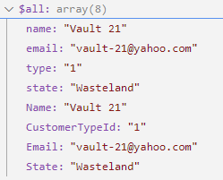

# Laravel 11 - Custom DB Naming Conventions

Building on the previous example, **5.4-PascalCase-REST-Api**, we're adding the ability to Post, Put, and Patch.

## Reproduce

### Part 1 - Create POST handler AKA: "_store()_"

1. Starting with the previous project, _**5.4-PascalCase-Filter**_
2. Updated tables to migration script
   1. `CustomerType` for `Customer` table to denote 1=Individual, 2=Business
   2. `PaidStatus` for `Invoice` table
3. Update `CustomerController` adding the `store(..)` method.
4. Update model `Customer`, adding DB columns to `$fillable` (previously, "magic" auto-filled it).
5. Create `StoreCustomerRequest`
   1. `php artisan make:request V1\StoreCustomerRequest`
   2. File: `app\Requests\V1`
   3. Add, `rules()`
6. Create `RestTest.http` for testing
   1. Path: `tests/RestTest.http`
   2. Add `POST` test with `Content-Type:` and `Accept:` set to `application/json`
      1. `Accept: application/json` is very important, otherwise it will redirect to a webpage (HTTP 302)

### Part 2 - Updating entries via PUT

#### Overview

* HTTP PUT - Replace an entire entity
  * You must include ALL fields required to replace, regardless.
* HTTP PATCH - Update using only the supplied fields
* Laravel's Controller `update()` handles both of these requests

#### Steps

1. Crete `UpdateCustomerRequest`
   1. `php artisan make:request V1\UpdateCustomerRequest`
   2. File: `app/Requests/V1/UpdateCustomerRequest.php`
2. Configure the `UpdateCustomerRequest`
   1. Copy\paste the `rules()` and `prepareForValidation()` from `StoreCustomerRequest` class into our class.
   2. Set the `authorization()` to `return true;`
3. Add 'PUT' to our `rules()`
   1. `if $method == 'PUT') {...}` - it **MUST** be UPPERCASE.
4. Add 'PATCH' to our rules `rules()`
   1. Add  `"sometimes"` to the rules array elements
   2. i.e. `"name" => ["sometimes", "required"],`

## Sample Code Highlights

### Request Class - Order of Execution

1. `authorize()` - Check if we're authorized to access
2. `prepareForValidation()` - Prepare the data for validation. _Overrides, ValidatesWhenResolvedTrait::prepareForValidation()_
3. `rules()` - Get the validation rules that apply to the request

### Request Class - Authorization

> **Remember**: Request classes override `authorize()` for our tests only; but NEVER in production.
>
> ```php
>   public function authorize(): bool
>   {
>     // Blindly returning `true` allows anyone to be authorized
>     return true;
>     ////return false;
>   }
> ```

## Recap and Thoughts

### PUT/PATCh JSON Key Transformation Approach

> **Issue:**
> When updating, if the JSON keys do not match our custom model properties (_`$fillable[..]`_), the `->update(..)` method wont be able to match the column names. In this project, our JSON element is called `type` and the model uses, `CustomerTypeId`.
>
> _In other language JSON implementations such as C# this can get auto-translated in a number of different ways._

In this project, we use the `UpdateCustomerRequest`'s `prepareForValidation()` to add new keys that match our `Customer` model's names and cases. Essentially, we are now carrying along duplicates - _double the original information_. Remember, **PUT** updates all columns (_except, Id_) and **PATCH** updates only those supplied, which is why a series of `if($this->..) $this->merge([...` statements are used.

> The `prepareForValidation()` create the following for **PATCH**.
> 
>
> ```php
> $customer->update($request->all());
> ```

In smaller transactions, this isn't such a big of a deal, however, with larger data there will be a larger transactional cost in performance.

There are other ways which this can be dealt with such as. One being, creating a method in our Controllers (_`CustomerController`_) to rename these keys so that our model can perform the database update.

## Translate API Input to PascalCase Model/DB

### REST Test

```http
PATCH {{baseUrl}}/api/v1/customers/21 HTTP/1.1
Content-Type: application/json
Accept: application/json

{
  "name": "Vault 21",
  "email": "vault-21@yahoo.com",
  "type": "1",
  "state": "Wasteland"
}
```

### BaseModel.php

```php
  /**
   * JSON element key to Model property name translator.
   * @var array<string,string>
   */
  protected $keyTranslator = array();

  /**
   * Transform input key(s) from JSON/FORM input to our model's property name(s)
   * based on our model's $keyTranslator to maintain API contracts.
   *
   * i.e. Input JSON element key is `type` and database column is `CustomerTypeId`.
   *
   * @param  array<string,string|mixed> $input  Input array
   * @return array<string,string|mixed> Input array using our desired key names.
   */
  public function transformKeys($input): array
  {
    $transformed = array();
    foreach ($input as $iKey => $iValue) {
      foreach ($this->keyTranslator as $jsonKey => $modelKey) {
        if ($iKey == $jsonKey)
          $transformed[$modelKey] = $iValue;
      }
    }

    return $transformed;
  }
```

### Customer.php

```php
  /**
   * JSON element key to Model property name translator.
   * @var array<string,string>
   */
  protected $keyTranslator  = [
    "name"       => "Name",
    "type"       => "CustomerTypeId",
    "email"      => "Email",
    "address"    => "Address",
    "city"       => "City",
    "state"      => "State",
    "country"    => "Country",
    "postalCode" => "PostalCode",
  ];
```

### CustomerController.php

```php
  public function update(UpdateCustomerRequest $request, Customer $customer): void
  {
    // Translate/transform JSON element keys to Model's conventions
    $transformed = $customer->transformKeys($request->all());
    $customer->update($transformed);
  }
```

#### Failed Attempt

Remember, the intent is to translate JSON element keys to our model's (`type` -> `CustomerTypeId`).

Below are some failed attempts:

```php
// Fails if `$input[keyName]` missing.
// A series of if-statements works, but it's error-prone
private function TransformKeys($input)
{
  $transformed["Name"]            = $input["name"];
  $transformed["CustomerTypeId"]  = $input["type"];
  $transformed["Email"]           = $input["email"];
  $transformed["Address"]         = $input["address"];
  $transformed["City"]            = $input["city"];
  $transformed["State"]           = $input["state"];
  $transformed["Country"]         = $input["country"];
  $transformed["PostalCode"]      = $input["postalCode"];

  return $transformed;
}
```

## References

The example created here is based on the PHP course,

* [How to build a REST API with Laravel (Sec 4.1)](https://youtu.be/YGqCZjdgJJk?t=3940).
* [Updating with PUT/PATCH (Sec 4.2)](https://youtu.be/YGqCZjdgJJk?t=4487)
* [GitHub](https://github.com/tutsplus/build-a-restful-api-with-laravel-2022)
* [TutsPlus](https://code.tutsplus.com/how-to-build-a-rest-api-with-laravel-php-full-course--cms-93786t).
